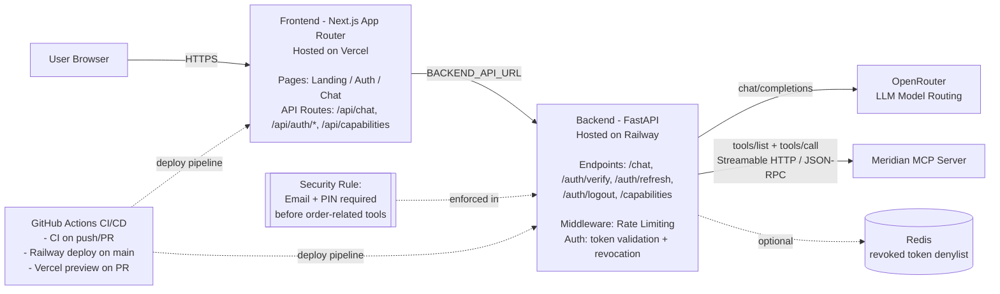
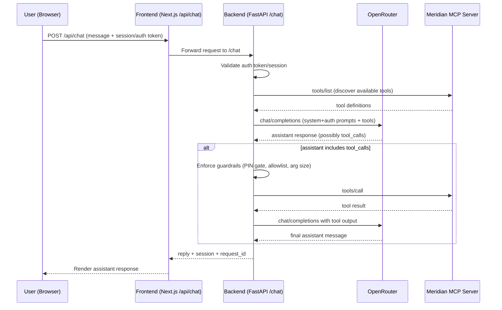

# Meridian Electronics: AI Support Agent (MVP)

## Executive Summary
This is a production-ready AI agent prototype built for Meridian Electronics to automate customer inquiries regarding product availability, orders, and authentication. By utilizing the Model Context Protocol (MCP), the agent securely interacts with internal business systems while maintaining a low operational cost via the Gemini 1.5 Flash model.

## 🏗 GenAI Clean System Architecture
The repository is organized following a strict "Clean System" pattern to ensure the code is auditable, secure, and ready for production deployment:

```text
meridian-ai-support/
├── frontend/                   # Next.js app (Vercel)
│   ├── app/
│   │   ├── api/chat/route.ts   # Frontend proxy to FastAPI backend
│   │   ├── layout.tsx
│   │   └── page.tsx
│   ├── app/components/
│   │   ├── ChatInterface.tsx
│   │   └── MessageBubble.tsx
│   ├── next.config.ts
│   ├── next-env.d.ts
│   ├── global.d.ts
│   ├── package.json
│   └── .env.example
├── backend/                    # FastAPI backend (Railway)
│   ├── app/
│   │   └── main.py             # Backend orchestrator (OpenRouter + MCP loop)
│   ├── prompts/
│   │   ├── system_prompt.txt   # Meridian Assistant persona & guardrails
│   │   └── auth_instructions.txt
│   ├── requirements.txt        # Python dependencies
│   ├── .env.example
│   └── README.md
├── package.json                # Root scripts (frontend + backend)
├── README.md                   # Project documentation
└── Makefile                    # One-command local workflows
```

- **`/frontend` (Frontend Orchestration):** Contains the Next.js App Router logic. `app/api/chat/route.ts` proxies chat requests to the FastAPI backend.
- **`/backend` (Backend Orchestration):** FastAPI service that runs the dialogue/tool loop with OpenRouter and Meridian MCP tools.
- **`/frontend/app/components` (Frontend UI):** Modular React components for the chat interface.
- **`/backend/prompts` (Prompt Management):** Versioned prompt files consumed by the FastAPI backend.

## 🚀 Authentication Protocol
To protect customer data, the agent implements a mandatory PIN-based verification flow. The agent is programmatically restricted from calling order-related MCP tools until a valid Email/PIN combination is verified against the internal test registry:

| Email | PIN |
| :--- | :--- |
| donaldgarcia@example.net | 7912 |
| michellejames@example.com | 1520 |
| laurahenderson@example.org | 1488 |
| spenceamanda@example.org | 2535 |
| glee@example.net | 4582 |
| williamsthomas@example.net | 4811 |
| justin78@example.net | 9279 |
| jason31@example.com | 1434 |
| samuel81@example.com | 4257 |
| williamleon@example.net | 9928 |

## 🛠 Setup & Deployment
1. **Configure Environment**:
   - `cp frontend/.env.example frontend/.env.local`
   - `cp backend/.env.example backend/.env`
   - Set your real values in those two files.
2. **Install Frontend Dependencies**:
   - `npm --prefix frontend install`
3. **Install Backend Dependencies**:
   - `python3 -m venv backend/.venv`
   - `source backend/.venv/bin/activate`
   - `pip install -r backend/requirements.txt`
4. **Run Backend (FastAPI)**:
   - `npm run backend:dev`
5. **Run Frontend (Next.js)**:
   - `npm run dev`

Root scripts available from the repository root:
- `npm run dev` (frontend)
- `npm run dev:frontend`
- `npm run backend:dev`
- `npm run backend:test`

`frontend/.env.local`:
   - `BACKEND_API_URL=http://127.0.0.1:8000`

`backend/.env`:
   - `OPENROUTER_API_KEY=...`
   - `MCP_SERVER_URL=...`
   - `FRONTEND_ORIGIN=http://localhost:3000`

### One-command workflows

- `make setup` installs frontend and backend dependencies
- `make dev` runs backend + frontend together
- `make test` runs backend API tests

## 🚀 Deployment Strategy
To ensure optimal performance and scalability, the application is split into two environments:

- **Frontend (UI & Proxy):** Deployed to **Vercel**. This hosts the React app and forwards `/api/chat` to the backend service.
- **Backend (FastAPI Orchestrator):** Deployed to **Railway**. This runs the OpenRouter + MCP tool-calling loop and authentication guardrails.

### Deployment Environment Wiring

- **Railway (backend service env vars):**
  - `OPENROUTER_API_KEY`
  - `MCP_SERVER_URL`
  - `FRONTEND_ORIGIN=https://meridian-ai-support.vercel.app`
  - Optional hardening vars: `OPENROUTER_MODEL`, `OPENROUTER_TEMPERATURE`, `OPENROUTER_MAX_TOKENS`, `HTTP_TIMEOUT_SECONDS`, `HTTP_MAX_RETRIES`, `HTTP_RETRY_BACKOFF_SECONDS`, `TOOL_LOOP_LIMIT`, `MAX_USER_MESSAGE_CHARS`, `MAX_TOOL_ARGUMENTS_CHARS`
- **Vercel (frontend project env vars):**
  - `BACKEND_API_URL=https://meridian-mcp-production.up.railway.app`

**Production URLs:**
- **Frontend:** `https://meridian-ai-support.vercel.app`
- **Backend API:** `https://meridian-mcp-production.up.railway.app`

## 🔒 Production Hardening Notes

- **Model parameters:** Supported via env vars (`OPENROUTER_MODEL`, `OPENROUTER_TEMPERATURE`, `OPENROUTER_MAX_TOKENS`).
- **Guardrails:** Message length cap, tool-argument size cap, and tool allowlist enforcement are enabled.
- **Exception handling:** Upstream OpenRouter/MCP timeouts and HTTP failures are mapped to `504`/`502` responses with retries.
- **Streaming:** Disabled for tool-calling mode in MVP (`stream=true` returns `400`). Full streaming requires SSE/WebSocket event orchestration.

## 🧭 Architecture Diagrams

### High-Level Architecture



### Chat Request Lifecycle



---
**Lead Engineer:** Franck  
**Date:** Thursday, April 30th, 2026

